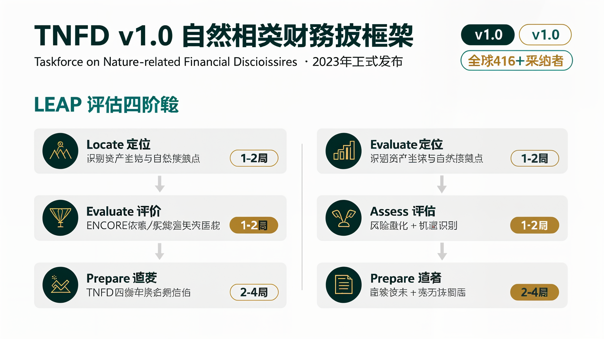

# TNFD-disclosure · 自然相关财务披露专业助手

> 🌍 让自然相关财务信息披露与 TCFD 一样触手可及。
> 基于 TNFD v1.0 官方框架 + 四大 ESG 咨询方法论 + 中国本土标准。
> 内置 ENCORE 数据 + 416+ 采纳者报告库。

[](https://opensource.org/licenses/MIT)
[](https://tnfd.global)
[](https://encorenature.org)
[](https://github.com/newversionparty-cn/TNFD-disclosure)
[]()

[**English Version**](README_en.md) · [**快速开始**](#快速开始) · [**方法论**](#方法论框架) · [**案例**](#行业标杆案例)

---

## TNFD Framework Overview



---

## 这是什么？

**TNFD-disclosure 是一个 AI Agent Skill（提示词库），不是 Python CLI 工具，也不是 Web 应用。**

它是一套结构化的提示词 + 知识库，专为支持自定义 Skill 的 AI Agent 设计——目前支持 **Hermes**、**Claude Code** 和 **OpenClaw**。

| 如果你是... | 使用方式 |
|-------------|---------|
| ESG 顾问 | 将 `SKILL.md` 内容作为 AI Agent 的 System Prompt |
| 企业可持续发展团队 | 启动 Agent 直接执行 TNFD LEAP 评估 |
| AI Agent 开发者 | 集成 Skill 到你的 Agent 框架 |
| 学术研究者 | 参考方法论框架 + 内置文献数据 |

---

## 核心功能

### 三阶段工作流程

```
Phase 0: 对标分析     →     Phase 1: LEAP 评估     →     Phase 2: 审计检查
  (Benchmark)                (Assess)                       (Assurance)
```

- **Phase 0 — Benchmark Analysis**：匹配行业标杆企业，分析最佳实践与差距
- **Phase 1 — LEAP Assessment**：Locate → Evaluate → Assess → Prepare 四阶段评估
- **Phase 2 — Assurance**：14 项披露建议覆盖检查，模拟审计意见

### LEAP 四阶段

| 阶段 | 核心问题 | 输出物 | 预计时间 |
|------|---------|--------|---------|
| **L**ocate · 定位 | 资产/供应链在哪里？ | 资产坐标清单 + 空间风险地图 | 1-2 周 |
| **E**valuate · 评价 | 依赖和影响是什么？ | 行业依赖矩阵 + 影响驱动因素 | 1-2 周 |
| **A**ssess · 评估 | 财务风险/机遇？ | 风险量化分析 + 机遇清单 | 2-4 周 |
| **P**repare · 准备 | 如何披露/响应？ | TNFD 报告 + 响应策略 | 2-4 周 |

### TNFD 14 项披露建议

| 支柱 | 建议数 | 核心检查点 |
|------|--------|-----------|
| **治理** Governance | 2 项 | 董事会监督 · 管理层职责 |
| **战略** Strategy | 2 项 | 业务影响 · 机遇影响 |
| **风险与影响管理** Risk & Impact | 4 项 | 识别流程 · 评估方法 · ERM 整合 · 影响管理 |
| **指标与目标** Metrics & Targets | 6 项 | KPI · 目标 · 方法变更 · 财务量化 · 资本配置 · 自然定价 |

---

## 为什么做这个项目

### 痛点

- **信息分散**：TNFD 官方文档 100+ 页，ENCORE 数据 18 个 CSV，行业指南分布在多个网站
- **咨询成本高**：四大 TNFD 咨询项目 50-200 万 RMB，中小企业难以承担
- **工具缺失**：缺乏一站式评估工具，数据收集和处理耗时

### 核心价值

| 维度 | 传统方式 | TNFD-disclosure |
|------|---------|----------------|
| 时间成本 | 8-12 周 | 2-4 周 |
| 经济成本 | 50-200 万 RMB | 免费开源 |
| 专业门槛 | 需要四大咨询 | AI 辅助引导 |
| 数据获取 | 手动收集 | 内置 ENCORE |
| 行业对标 | 付费购买 | 内置 416+ 案例 |
| 审计准备 | 额外收费 | 内置检查 |

---

## 快速开始

### 安装

```bash
# 克隆仓库
git clone https://github.com/newversionparty-cn/TNFD-disclosure.git
cd TNFD-disclosure

# 符号链接到 Hermes
ln -s $(pwd) ~/.Hermes/skills/tnfd-disclosure
```

### 使用示例

**场景 1：行业对标**

```
用户：光伏行业有哪些公司披露了 TNFD？

TNFD-disclosure：光伏行业已披露 TNFD 的标杆企业：

| 公司 | 报告类型 | 发布时间 | 方法论 | 亮点 |
|------|---------|---------|--------|------|
| 隆基绿能 | 独立 TNFD 报告 | 2025 年 11 月 | TNFD LEAP + 安永 CCaSS | 自然资本评估试点 |
| 协鑫科技 | ESG 报告整合 | 2025 年 4 月 | TNFD LEAP | 供应链风险评估 |
| Vestas | 独立 TNFD 报告 | 2024 年 12 月 | TNFD LEAP | 有限鉴证 |

需要我帮您获取报告 PDF 或进入 LEAP 评估吗？
```

**场景 2：启动 LEAP 评估**

```
用户：我想做 TNFD 披露，怎么开始？

TNFD-disclosure：推荐流程：
Phase 0: 对标分析（了解行业最佳实践）
Phase 1: LEAP 评估（Locate → Evaluate → Assess → Prepare）
Phase 2: 审计检查（14 项覆盖检查）

请选择您的起点。
```

---

## 方法论框架

### 四大方法论对比

| | 安永 (EY) | 德勤 (Deloitte) | 普华永道 (PwC) | 毕马威 (KPMG) |
|---|---|---|---|---|
| **方法论** | CCaSS | Climate & Sustainability | Five Things | NATURE Framework |
| **特色** | 自然资本货币化 · 财务整合导向 | 数字化监控 · 循环经济模式 | 5 步框架 · 结构化检查清单 | 成熟度评估 · 分阶段实施 |
| **合作** | IUCN 战略伙伴 | 自然资本议定书 | 披露模板 | 利益相关方参与 |

### TNFD 与 TCFD 的关系

TNFD 在 TCFD 四大支柱基础上，新增 **LEAP 评估方法** 和 **自然影响管理** 维度：

- **治理** → 对应 TCFD 治理
- **战略** → 对应 TCFD 战略
- **风险与影响管理** → 扩展自 TCFD 风险管理，新增自然影响管理
- **指标与目标** → 扩展自 TCFD 指标与目标，新增自然定价相关指标

---

## 行业标杆案例

### 隆基绿能（光伏行业）

> **报告信息**：2025 年 11 月发布 · 独立 TNFD 报告 · TNFD LEAP + 安永 CCaSS

**核心亮点**：
- 🏆 中国光伏企业首份独立 TNFD 报告
- 💰 嘉兴基地自然资本评估节约 2149.6 万元
- 🎯 2050 年生物多样性"净零损失"目标
- 🌿 2060 年自然"净正面影响"远景

**LEAP 完整度**：4/4 阶段完整 · **14 项覆盖**：10/14 项（71%）

---

### 牧原股份（养殖行业）

> **报告信息**：2026 年 3 月发布（HKEX）· ESG 报告整合 · TNFD LEAP + 德勤 + 自然资本议定书

**核心亮点**：
- 📋 自然资本议定书 9 步骤完整应用
- 📊 49 项监测指标（土壤 16 项、地下水 12 项...）
- 🔄 供应链风险传导模型 + 情景模拟

---

## 数据结构

```
TNFD-disclosure/
├── SKILL.md              # Agent Skill 定义（System Prompt）
├── QUICK_REFERENCE.md    # 快速参考卡片
├── CHANGELOG.md          # 更新日志
├── assets/               # 静态资源
│   └── *.png             # 信息图、流程图
├── data/                 # 内置数据
│   └── encore/           # ENCORE 解析数据
├── prompts/              # LEAP 各阶段 Prompt
│   ├── 01-locate.md
│   ├── 02-evaluate.md
│   ├── 03-assess.md
│   └── 04-prepare.md
├── references/           # 方法论文档
│   ├── tnfd-leap-complete-guide.md
│   ├── data-sources-registration-guide.md
│   ├── industry-guidance.md
│   ├── big4-methodologies.md
│   └── china-esg-standards.md
└── scripts/              # 辅助脚本
    └── process_encore_data.py
```

---

## 贡献指南

欢迎提交 Issue 和 Pull Request！

### 报告质量评级标准（自评参考）

| 等级 | 描述 | 14 项覆盖 |
|------|------|---------|
| A | 完整披露，审计师可出具无保留意见 | 14/14 |
| B+ | 基本完整，有少量改进空间 | 12-13/14 |
| B | 部分披露，常见红旗信号 | 10-11/14 |
| C | 初步尝试，需要重大改进 | 7-9/14 |
| D | 框架搭建阶段 | < 7/14 |

---

## 免责声明

本 Skill 基于 TNFD v1.0 官方框架和四大公开方法论提供指导，**不构成正式审计或鉴证意见**。正式披露建议：
1. 完成完整的 LEAP 评估
2. 进行第三方验证
3. 咨询专业审计机构

---

*项目维护者：[Tom](https://github.com/newversionparty-cn) · 提交 Issue 或 PR 让我们做得更好*
